# Architecture Diagrams Collection

**SpringMVC Agent Analyzer - Complete Visual Reference**

Version: 0.1.0
Date: 2025-10-05

---

## Table of Contents

1. [Component Relationship Diagrams](#component-relationship-diagrams)
2. [Data Flow Diagrams](#data-flow-diagrams)
3. [Sequence Diagrams](#sequence-diagrams)
4. [State Diagrams](#state-diagrams)
5. [Class Diagrams](#class-diagrams)
6. [Deployment Diagrams](#deployment-diagrams)

---

## Component Relationship Diagrams

### 1. Layer Architecture


### 2. Agent Inheritance Hierarchy

```mermaid classDiagram
    class BaseAgent {
        <<abstract>>
        +agent_name: str
        +model_router: ModelRouter
        +prompt_manager: PromptManager
        +cost_tracker: CostTracker
        +cache_manager: CacheManager
        +config: Dict

        +analyze(file_path)* Dict
        #_query_llm(prompt) Dict
        #_load_file_with_context(path) str
        #_extract_json_from_response(response) Dict
        +validate_result(result) bool
    }

    class ControllerAgent {
        +analyze(file_path) Dict
        -_parse_request_mapping() List
        -_extract_dependencies() List
    }

    class JSPAgent {
        +analyze(file_path) Dict
        -_extract_includes() List
        -_extract_ajax_calls() List
        -_extract_forms() List
    }

    class ServiceAgent {
        +analyze(file_path) Dict
        -_extract_transactional() bool
        -_extract_mapper_deps() List
    }

    class MapperAgent {
        +analyze(file_path) Dict
        -_parse_sql_statements() List
        -_detect_procedure_calls() List
    }

    class ProcedureAgent {
        +analyze(procedure_name) Dict
        -_infer_business_purpose() str
        -_detect_trigger_method() str
    }

    BaseAgent <|-- ControllerAgent
    BaseAgent <|-- JSPAgent
    BaseAgent <|-- ServiceAgent
    BaseAgent <|-- MapperAgent
    BaseAgent <|-- ProcedureAgent
```

### 3. Core Infrastructure Components


---

## Data Flow Diagrams

### 1. Single File Analysis Flow


### 2. Multi-File Batch Analysis


### 3. Knowledge Graph Construction

```mermaid
flowchart TB
    Start([Analysis Results]) --> ParseC[Parse Controllers<br/>Extract Mappings]
    Start --> ParseJ[Parse JSPs<br/>Extract AJAX Calls]
    Start --> ParseS[Parse Services<br/>Extract Calls]
    Start --> ParseM[Parse Mappers<br/>Extract SQL]

    ParseC --> NodesC[Create CONTROLLER Nodes]
    ParseJ --> NodesJ[Create JSP Nodes]
    ParseS --> NodesS[Create SERVICE Nodes]
    ParseM --> NodesM[Create MAPPER Nodes]

    NodesC --> MergeNodes[Merge All Nodes]
    NodesJ --> MergeNodes
    NodesS --> MergeNodes
    NodesM --> MergeNodes

    MergeNodes --> Graph[(NetworkX Graph)]

    ParseJ --> EdgeJC[AJAX_CALL Edges<br/>JSP → Controller]
    ParseC --> EdgeCS[INVOKES Edges<br/>Controller → Service]
    ParseS --> EdgeSM[CALLS Edges<br/>Service → Mapper]
    ParseM --> EdgeMT[QUERIES Edges<br/>Mapper → Table]

    EdgeJC --> MergeEdges[Merge All Edges]
    EdgeCS --> MergeEdges
    EdgeSM --> MergeEdges
    EdgeMT --> MergeEdges

    MergeEdges --> Graph

    Graph --> ValidateGraph{Validate}
    ValidateGraph -->|Broken Refs| Warn[Log Warnings]
    ValidateGraph -->|OK| Stats[Calculate Stats]

    Warn --> Stats
    Stats --> SaveJSON[Save graph.json]
    SaveJSON --> End([Graph Ready])

    style Graph fill:#99ccff
```



---

## Sequence Diagrams

### 1. Controller Analysis with Cache Miss

```mermaid
sequenceDiagram
    participant U as User
    participant M as MCP Server
    participant A as ControllerAgent
    participant C as CacheManager
    participant PM as PromptManager
    participant R as ModelRouter
    participant H as Haiku API
    participant V as JavaValidator
    participant CT as CostTracker

    U->>M: analyze_controller("UserController.java")
    M->>A: analyze(file_path)

    A->>A: Load file content
    A->>C: get(agent, file_path, content)
    C-->>A: None (cache miss)

    A->>PM: build_prompt("controller_analysis", context)
    PM->>PM: Load template
    PM->>PM: Inject 2 few-shot examples
    PM-->>A: Complete prompt (1500 tokens)

    A->>R: query(prompt, complexity="simple")
    R->>H: messages.create(model="haiku", ...)
    H-->>R: Response (confidence: 0.92, tokens: 1245+356)

    R->>R: Extract confidence: 0.92
    R->>R: Check threshold: 0.92 >= 0.9 ✓

    R-->>A: {response, model, cost: $0.00234, confidence: 0.92}

    A->>A: Extract JSON from response
    A->>V: validate_syntax(extracted_json)
    V-->>A: {valid: true}

    A->>C: save(agent, file_path, content, result)
    C-->>A: Saved

    A->>CT: record(agent, model, tokens, cost)
    CT-->>A: Recorded

    A-->>M: {analysis: {...}, metadata: {...}}
    M-->>U: Analysis result
```



### 2. Controller Analysis with Cache Hit


### 3. Model Escalation (Haiku → Sonnet)

```mermaid
sequenceDiagram
    participant A as Agent
    participant R as ModelRouter
    participant H as Haiku API
    participant S as Sonnet API

    A->>R: query(complex_prompt, complexity="medium")

    R->>H: Try Haiku first
    H-->>R: Response (confidence: 0.75)

    R->>R: Extract confidence: 0.75
    R->>R: Check threshold: 0.75 < 0.9 ✗
    R->>R: Escalate to Sonnet

    Note over R: Log: "Haiku low confidence (0.75),<br/>escalating to Sonnet"

    R->>S: Same prompt to Sonnet
    S-->>R: Response (confidence: 0.88)

    R->>R: Extract confidence: 0.88
    R->>R: Check threshold: 0.88 >= 0.85 ✓

    R-->>A: {response, model: "sonnet", cost: $0.015,<br/>confidence: 0.88, escalations: 1}

    Note over A,S: Cost increased 6x ($0.002 → $0.015)<br/>but accuracy improved (0.75 → 0.88)
```



---

## State Diagrams

### 1. Analysis State Machine


### 2. Model Router State Machine


### 3. Cache Entry Lifecycle


---

## Class Diagrams

### 1. Core Infrastructure Classes


### 2. Agent Classes


### 3. Graph Classes


---

## Deployment Diagrams

### 1. Local Development Setup


### 2. Multi-Worker Parallel Processing


### 3. Production Deployment (Future)


---

## Decision Trees

### 1. Agent Selection Decision Tree

```mermaid
graph TD
    Start{File<br/>Extension?}

    Start -->|.java| JavaFile{Contains?}
    Start -->|.jsp| JSPAgent[JSP Agent]
    Start -->|.xml| XMLFile{File Name?}
    Start -->|.sql| ProcedureAgent[Procedure Agent]

    JavaFile -->|@Controller<br/>@RestController| ControllerAgent[Controller Agent]
    JavaFile -->|@Service<br/>@Component| ServiceAgent[Service Agent]
    JavaFile -->|interface<br/>Mapper| JavaValidator[Java Validator<br/>Then Manual]

    XMLFile -->|*Mapper.xml| MapperAgent[Mapper Agent]
    XMLFile -->|Other| Skip[Skip Analysis]

    ControllerAgent --> End
    JSPAgent --> End
    ServiceAgent --> End
    MapperAgent --> End
    ProcedureAgent --> End
    Skip --> End

    End([Route to Agent])
```

### 2. Cost Optimization Decision Tree


---

## Metrics & Monitoring

### 1. Performance Metrics Dashboard

```mermaid
graph LR
    subgraph "Analysis Metrics"
        A1[Files Analyzed<br/>Target: 30/min]
        A2[Avg Latency<br/>Target: < 2s]
        A3[Error Rate<br/>Target: < 5%]
    end

    subgraph "Cost Metrics"
        C1[Total Cost<br/>Budget: $5]
        C2[Cost per File<br/>Target: < $0.05]
        C3[Cache Hit Rate<br/>Target: >= 60%]
    end

    subgraph "Quality Metrics"
        Q1[Avg Confidence<br/>Target: >= 0.85]
        Q2[Validation Pass<br/>Target: >= 95%]
        Q3[Graph Coverage<br/>Target: >= 90%]
    end

    subgraph "Model Metrics"
        M1[Haiku Usage<br/>Target: 70%]
        M2[Sonnet Usage<br/>Target: 25%]
        M3[Opus Usage<br/>Target: 5%]
    end

    style A1 fill:#e1f5ff
    style C1 fill:#ffe1e1
    style Q1 fill:#e1ffe1
    style M1 fill:#fff4e1
```

---

**Document Version**: 1.0
**Last Updated**: 2025-10-05
**Maintained By**: Development Team

---

## How to Use These Diagrams

### 1. For Understanding Architecture
- Start with **Layer Architecture** diagram
- Review **Component Relationship** diagrams
- Study **Data Flow** diagrams

### 2. For Implementation
- Reference **Sequence Diagrams** for interaction patterns
- Check **State Diagrams** for logic flow
- Use **Class Diagrams** for API contracts

### 3. For Debugging
- Trace through **Sequence Diagrams**
- Check **State Machines** for invalid states
- Review **Data Flow** for bottlenecks

### 4. For Cost Optimization
- Study **Model Router Decision Tree**
- Review **Cost Optimization Decision Tree**
- Monitor **Cost Metrics** dashboard

---

**All diagrams are Mermaid-compatible and can be rendered in:**
- GitHub Markdown
- GitLab
- Obsidian
- VS Code (with Mermaid extension)
- Online: mermaid.live
