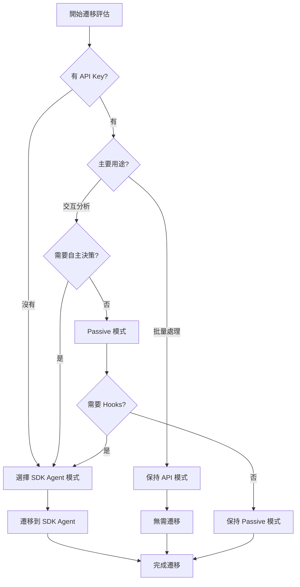

# 遷移到 SDK Agent 模式指南

**從 MCP 模式遷移到 SDK Agent 模式的完整指南**

本文檔幫助您從現有的 API 模式或 Passive 模式遷移到新的 SDK Agent 模式，享受更強大的交互式分析功能。

---

## 📋 目錄

- [為什麼遷移？](#為什麼遷移)
- [遷移前準備](#遷移前準備)
- [遷移決策樹](#遷移決策樹)
- [遷移步驟](#遷移步驟)
- [功能對照表](#功能對照表)
- [代碼遷移示例](#代碼遷移示例)
- [回滾策略](#回滾策略)
- [常見遷移問題](#常見遷移問題)

---

## 為什麼遷移？

### SDK Agent 模式的優勢

| 優勢 | 說明 | 價值 |
|------|------|------|
| **🆓 零 API 成本** | 使用 Claude Code 訂閱，無需 API Key | 節省 ~$4.23/專案 |
| **💬 雙向對話** | Agent 可主動提問、澄清需求 | 提升分析準確度 |
| **🎯 自主決策** | Agent 自主選擇工具和策略 | 減少人工干預 |
| **🔧 Hooks 系統** | 驗證、優化、監控等自動化 | 提高結果質量 |
| **⚡ 動態控制** | 運行時調整模型、權限 | 靈活應對複雜場景 |
| **🔒 權限管理** | 細粒度控制工具使用 | 更安全可控 |
| **📊 上下文管理** | 自動壓縮長對話 | 支持長時間分析 |

### 何時應該遷移？

✅ **建議遷移**，如果您：
- 只有 Claude Code 訂閱（沒有 Anthropic API Key）
- 需要交互式、探索性代碼分析
- 想要 Agent 自主決策分析策略
- 需要細粒度的工具權限控制
- 希望在分析過程中動態調整行為
- 需要驗證、緩存等高級功能

❌ **暫時不遷移**，如果您：
- 主要進行批量自動處理（API 模式更合適）
- 已有穩定的 API 模式工作流
- 團隊成員不熟悉交互式 CLI 工具
- 需要精確控制每一步操作（非自主模式）

### 成本對比

| 場景 | API 模式 | Passive 模式 | SDK Agent 模式 |
|------|---------|--------------|---------------|
| **100 文件專案** | $4.23 | $0 | **$0** |
| **需要 API Key** | ✅ | ❌ | ❌ |
| **交互式分析** | ❌ | 有限 | ✅ 完整支持 |
| **批量處理** | ✅ 最佳 | ❌ | ✅ 支持 |
| **自主決策** | ❌ | ❌ | ✅ 完整支持 |

**結論**：如果您只有 Claude Code 訂閱，SDK Agent 模式是最佳選擇！

---

## 遷移前準備

### 1. 環境檢查

```bash
# 檢查 Python 版本（需 3.10+）
python --version

# 檢查 Claude Code CLI
claude --version

# 檢查現有配置
cat config/config.yaml
```

### 2. 備份現有配置

```bash
# 備份配置文件
cp config/config.yaml config/config.yaml.backup

# 備份分析結果
cp -r .cache .cache.backup
cp -r output output.backup

# 備份圖數據（如果有）
cp -r graphs graphs.backup
```

### 3. 安裝 SDK

```bash
# 安裝 Claude Agent SDK
pip install claude-agent-sdk>=0.1.0

# 驗證安裝
python -c "import claude_agent_sdk; print('SDK version:', claude_agent_sdk.__version__)"
```

### 4. 測試環境

```bash
# 測試 Claude Code 連接
claude auth status

# 測試基本功能
python -c "
from claude_agent_sdk import query
result = query('Hello, test')
print('Test successful')
"
```

---

## 遷移決策樹



### 決策要點

**選擇 SDK Agent 模式**，當滿足以下任一條件：
1. 無 API Key，只有 Claude Code 訂閱
2. 需要交互式對話分析
3. 需要 Agent 自主決策
4. 需要 Hooks 系統（驗證、緩存、上下文管理）
5. 需要動態控制（運行時調整模型、權限）
6. 需要細粒度權限管理

**保持 API 模式**，當滿足：
1. 有 API Key 且預算充足
2. 主要批量處理，無需交互
3. 已有穩定的自動化流程

**保持 Passive 模式**，當滿足：
1. 無 API Key，只需偶爾查詢
2. 不需要 Agent 自主決策
3. 簡單的圖查詢即可滿足需求

---

## 遷移步驟

### Step 1: 創建 SDK Agent 配置

創建 `config/sdk_agent_config.yaml`：

```yaml
# SDK Agent 模式配置
server:
  mode: "sdk_agent"

models:
  # Claude Code 模型
  default: "claude-sonnet-4-5"
  haiku: "claude-3-5-haiku-20241022"
  sonnet: "claude-3-5-sonnet-20241022"

agents:
  min_confidence: 0.7
  structure_validation_penalty: 0.6

sdk_agent:
  # SDK 特定配置
  max_turns: 20
  permission_mode: "acceptEdits"
  hooks_enabled: true

  hooks:
    validation:
      enabled: true
      min_confidence: 0.7

    context_manager:
      enabled: true
      compact_threshold: 50

    cache:
      enabled: true
      similarity_threshold: 0.85

  prompts:
    system_prompt_path: "prompts/sdk_agent/system_prompt.md"
    include_examples: true

graph:
  auto_build: true
  export_format: "d3"

cache:
  cache_dir: ".cache"
  max_size_mb: 1000
  ttl_seconds: 86400
```

### Step 2: 創建 System Prompt

創建 `prompts/sdk_agent/system_prompt.md`：

```markdown
# SpringMVC Agent Analyzer - System Prompt

你是專業的 Spring MVC 代碼分析專家，擅長：

## 核心能力
1. **代碼理解**：深入理解 Spring MVC、JSP、MyBatis、Oracle 技術棧
2. **架構分析**：分析三層架構、依賴關係、數據流
3. **問題診斷**：識別性能瓶頸、安全漏洞、技術債務
4. **重構建議**：提供切實可行的重構方案

## 分析原則
- **準確性第一**：不確定時主動詢問或使用更強模型
- **上下文感知**：充分利用依賴關係和歷史分析
- **結果驗證**：使用 Hooks 自動驗證分析結果
- **主動溝通**：遇到歧義時主動澄清需求

## 可用工具
- `analyze_controller`: 分析 Spring Controller
- `analyze_service`: 分析 Service 層
- `analyze_mapper`: 分析 MyBatis Mapper
- `analyze_jsp`: 分析 JSP 視圖
- `query_graph`: 查詢知識圖
- `find_dependencies`: 查找依賴
- `analyze_impact`: 影響分析
- `export_graph`: 導出圖

## 工作流程
1. 理解用戶需求
2. 選擇合適的工具
3. 執行分析
4. 驗證結果（通過 Hooks）
5. 提供洞察和建議

## 輸出格式
- 使用清晰的 Markdown 格式
- 重要發現使用 emoji 標記（🔴 嚴重、🟡 中等、🟢 輕微）
- 提供代碼示例時使用語法高亮
- 包含可執行的建議步驟
```

### Step 3: 測試基本功能

```bash
# 測試配置
python run_sdk_agent.py --validate-config

# 測試啟動
python run_sdk_agent.py --interactive --dry-run

# 實際測試
python run_sdk_agent.py --interactive
```

在交互模式中測試：
```
> 測試：分析 src/main/java/com/example/controller/UserController.java
> 測試：查詢圖統計信息
> 測試：退出
```

### Step 4: 遷移現有工作流

#### 從 API 模式遷移

**舊的 API 模式工作流**：
```bash
# 1. 啟動 MCP Server
python run_mcp_server.py

# 2. 在 Claude Code 中調用工具
# > 使用 analyze_directory 分析 src/main/java
# > 使用 query_graph 查詢圖
```

**新的 SDK Agent 工作流**：
```bash
# 1. 直接啟動 SDK Agent
python run_sdk_agent.py --interactive

# 2. 自然對話
# > 分析 src/main/java 目錄的所有代碼
# > 顯示圖統計信息
# > 找出最複雜的 Controller
```

#### 從 Passive 模式遷移

**舊的 Passive 模式工作流**：
```bash
# 1. 啟動 MCP Server（Passive 模式）
python run_mcp_server.py --mode passive

# 2. 在 Claude Code 中：
# > 使用 read_file_with_prompt 獲取文件和提示
# > 手動分析
# > 使用 submit_analysis 提交結果
# > 使用 build_graph 構建圖
```

**新的 SDK Agent 工作流**：
```bash
# 1. 直接啟動 SDK Agent（自動處理所有步驟）
python run_sdk_agent.py --interactive

# 2. Agent 自動處理：
# > 分析 UserController.java
# [Agent 自動：讀取 → 分析 → 提交 → 構建圖]
```

### Step 5: 驗證遷移結果

**驗證清單**：
- [ ] SDK Agent 成功啟動
- [ ] 交互式對話正常
- [ ] 工具調用成功
- [ ] Hooks 正常工作
- [ ] 圖構建成功
- [ ] 分析結果準確
- [ ] 緩存正常工作
- [ ] 導出功能正常

**驗證腳本**：
```python
# tests/verify_migration.py
import asyncio
from sdk_agent.client import SpringMVCAnalyzerAgent

async def verify():
    agent = SpringMVCAnalyzerAgent(
        config_path="config/sdk_agent_config.yaml"
    )

    print("✓ Agent 初始化成功")

    # 測試分析
    from sdk_agent.tools.controller_tools import analyze_controller
    result = await analyze_controller({
        "file_path": "tests/fixtures/UserController.java"
    })

    assert result["class_name"] == "UserController"
    print("✓ Controller 分析成功")

    # 測試圖操作
    from sdk_agent.tools.graph_tools import query_graph
    stats = await query_graph({"query_type": "stats"})

    assert "num_nodes" in stats
    print("✓ 圖查詢成功")

    print("\n🎉 遷移驗證完成！")

asyncio.run(verify())
```

運行驗證：
```bash
python tests/verify_migration.py
```

---

## 功能對照表

### 工具對照

| API/Passive 模式工具 | SDK Agent 模式工具 | 變化說明 |
|---------------------|-------------------|---------|
| `analyze_file` | `analyze_controller`<br>`analyze_service`<br>等 | **更細粒度**：按類型拆分 |
| `analyze_directory` | `analyze_project` | **更智能**：自動識別文件類型 |
| `query_graph` | `query_graph` | **一致**：API 相同 |
| `find_dependencies` | `find_dependencies` | **一致**：API 相同 |
| `analyze_impact` | `analyze_impact` | **一致**：API 相同 |
| `export_graph` | `export_graph` | **一致**：API 相同 |
| ❌ 無 | `list_files` | **新增**：列出專案文件 |
| ❌ 無 | `read_file` | **新增**：讀取文件內容 |
| `read_file_with_prompt` (Passive) | ❌ 移除 | **自動化**：Agent 自動處理 |
| `submit_analysis` (Passive) | ❌ 移除 | **自動化**：Agent 自動提交 |

### 配置對照

| 配置項 | API 模式 | Passive 模式 | SDK Agent 模式 |
|--------|---------|--------------|---------------|
| **mode** | `api` | `passive` | `sdk_agent` |
| **API Key** | 必需 | 不需要 | 不需要 |
| **models** | Haiku/Sonnet/Opus | ❌ | Haiku/Sonnet/Opus |
| **hooks** | ❌ | ❌ | ✅ 完整支持 |
| **permissions** | ❌ | ❌ | ✅ 細粒度控制 |
| **max_turns** | ❌ | ❌ | ✅ 對話輪數限制 |
| **system_prompt** | ❌ | ❌ | ✅ 自定義提示 |

### 使用方式對照

| 使用場景 | API 模式 | Passive 模式 | SDK Agent 模式 |
|---------|---------|--------------|---------------|
| **啟動方式** | `run_mcp_server.py` | `run_mcp_server.py --mode passive` | `run_sdk_agent.py --interactive` |
| **交互方式** | Claude Code 調用 MCP 工具 | Claude Code 手動調用工具 | 直接對話 |
| **分析單文件** | MCP 工具調用 | 手動讀取 → 分析 → 提交 | 自然語言請求 |
| **批量分析** | MCP `analyze_directory` | 逐個手動處理 | `analyze_project` 或對話 |
| **圖查詢** | MCP `query_graph` | MCP `query_graph` | `query_graph` 或對話 |

---

## 代碼遷移示例

### 示例 1: 分析 Controller

#### API 模式（舊）

```python
# 通過 MCP 調用
# 在 Claude Code 中執行：
# > 使用 analyze_file 工具分析 src/main/java/com/example/UserController.java
```

#### SDK Agent 模式（新）

```python
# 方式 1: 交互式對話
python run_sdk_agent.py --interactive
# > 分析 src/main/java/com/example/UserController.java

# 方式 2: 編程 API
from sdk_agent.tools.controller_tools import analyze_controller

result = await analyze_controller({
    "file_path": "src/main/java/com/example/UserController.java"
})

print(f"Class: {result['class_name']}")
print(f"Endpoints: {len(result['endpoints'])}")
```

### 示例 2: 批量分析專案

#### API 模式（舊）

```python
# MCP Server 調用
# 在 Claude Code 中：
# > 使用 analyze_directory 工具分析 src/main/java，pattern="**/*.java"
```

#### SDK Agent 模式（新）

```python
# 方式 1: 交互式
python run_sdk_agent.py --interactive
# > 分析 src/main/java 目錄的所有 Java 文件

# 方式 2: 命令行
python run_sdk_agent.py --analyze-project src/main/java --output-format markdown

# 方式 3: 編程 API
from sdk_agent.client import SpringMVCAnalyzerAgent

agent = SpringMVCAnalyzerAgent()
result = await agent.analyze_project(
    project_path="src/main/java",
    output_format="json"
)
```

### 示例 3: 依賴分析

#### Passive 模式（舊）

```python
# 步驟 1: 讀取文件
# > 使用 read_file_with_prompt 讀取 UserController.java

# 步驟 2: 分析（手動）
# > [Claude Code 分析文件內容]

# 步驟 3: 提交結果
# > 使用 submit_analysis 提交分析結果

# 步驟 4: 構建圖
# > 使用 build_graph 構建知識圖

# 步驟 5: 查詢依賴
# > 使用 find_dependencies 查找依賴
```

#### SDK Agent 模式（新）

```python
# 一步完成！
python run_sdk_agent.py --interactive
# > UserController 依賴哪些 Service？

# Agent 自動：
# 1. 分析 UserController
# 2. 構建圖
# 3. 查詢依賴
# 4. 返回結果
```

### 示例 4: 影響分析

#### API 模式（舊）

```python
# 兩步操作
# 步驟 1: 構建圖
# > 使用 analyze_directory 分析並構建圖

# 步驟 2: 影響分析
# > 使用 analyze_impact，node_id="com.example.UserService"
```

#### SDK Agent 模式（新）

```python
# 自然對話
python run_sdk_agent.py --interactive
# > 如果修改 UserService，會影響哪些組件？

# Agent 自動：
# 1. 識別 UserService 節點
# 2. 執行影響分析
# 3. 返回影響範圍和建議
```

### 示例 5: 導出圖數據

#### 兩種模式都相似

```python
# API/Passive 模式
# > 使用 export_graph 工具，output_path="output/graph.html", format="d3"

# SDK Agent 模式
python run_sdk_agent.py --interactive
# > 導出知識圖到 output/graph.html，使用 D3 格式

# 或編程 API
from sdk_agent.tools.graph_tools import export_graph

await export_graph({
    "output_path": "output/graph.html",
    "format": "d3"
})
```

### 示例 6: 自定義工作流

#### API 模式（需手動編排）

```python
# 複雜工作流需要手動調用多個工具
# 1. analyze_file
# 2. query_graph
# 3. find_dependencies
# 4. analyze_impact
# 5. export_graph
```

#### SDK Agent 模式（Agent 自主決策）

```python
python run_sdk_agent.py --interactive

# 複雜請求，Agent 自動編排工具
User: """
分析 OrderService 的完整依賴鏈，識別潛在風險，
生成依賴關係圖，並給出重構建議。
"""

# Agent 自動執行：
# 1. analyze_service (OrderService)
# 2. find_dependencies (遞歸查找)
# 3. analyze_impact (影響分析)
# 4. identify_risks (風險識別)
# 5. export_graph (生成圖)
# 6. generate_recommendations (生成建議)
```

---

## 回滾策略

如果遷移後遇到問題，可以隨時回滾：

### 1. 保留舊模式配置

```bash
# SDK Agent 和 舊模式可共存
# 不要刪除舊的配置文件

# API 模式
config/config.yaml

# Passive 模式
config/config.yaml (mode: passive)

# SDK Agent 模式
config/sdk_agent_config.yaml
```

### 2. 快速切換模式

```bash
# 使用 API 模式
python run_mcp_server.py

# 使用 Passive 模式
python run_mcp_server.py --mode passive

# 使用 SDK Agent 模式
python run_sdk_agent.py --interactive
```

### 3. 恢復備份數據

```bash
# 恢復配置
cp config/config.yaml.backup config/config.yaml

# 恢復緩存
rm -rf .cache
cp -r .cache.backup .cache

# 恢復分析結果
rm -rf output
cp -r output.backup output
```

### 4. 卸載 SDK

```bash
# 如果不再使用 SDK Agent
pip uninstall claude-agent-sdk

# 清理 SDK 相關文件
rm -rf sdk_agent/
rm config/sdk_agent_config.yaml
rm prompts/sdk_agent/
```

---

## 常見遷移問題

### 問題 1: SDK Agent 啟動失敗

**錯誤**：
```
ModuleNotFoundError: No module named 'claude_agent_sdk'
```

**解決**：
```bash
pip install claude-agent-sdk>=0.1.0
pip show claude-agent-sdk  # 驗證安裝
```

### 問題 2: Claude Code 認證失敗

**錯誤**：
```
AuthenticationError: Not authenticated with Claude Code
```

**解決**：
```bash
# 重新認證
claude auth login

# 檢查狀態
claude auth status
```

### 問題 3: 配置文件找不到

**錯誤**：
```
FileNotFoundError: config/sdk_agent_config.yaml not found
```

**解決**：
```bash
# 創建配置文件（從模板）
cp config/sdk_agent_config.example.yaml config/sdk_agent_config.yaml

# 或手動創建（參考 Step 1）
```

### 問題 4: Hooks 不生效

**症狀**：配置了 Hooks 但沒有執行

**解決**：
```yaml
# 檢查配置
sdk_agent:
  hooks_enabled: true  # ← 確保全局開關為 true

  hooks:
    validation:
      enabled: true    # ← 確保具體 Hook 開關為 true
```

### 問題 5: 工具調用失敗

**錯誤**：
```
ToolExecutionError: Tool 'analyze_controller' not found
```

**解決**：
```python
# 檢查工具註冊
from sdk_agent.client import SpringMVCAnalyzerAgent
agent = SpringMVCAnalyzerAgent()

# 列出已註冊的工具
print(agent.tools)

# 如果工具缺失，檢查導入
# 在 sdk_agent/__init__.py 中確保所有工具模塊被導入
```

### 問題 6: 分析結果與舊模式不一致

**症狀**：SDK Agent 結果與 API/Passive 模式不同

**原因**：
- SDK Agent 使用不同的模型策略
- Hooks 可能調整了結果
- 緩存影響

**解決**：
```bash
# 清除緩存重新分析
rm -rf .cache/*

# 禁用 Hooks 對比
# config/sdk_agent_config.yaml
sdk_agent:
  hooks_enabled: false

# 使用相同模型
models:
  default: "claude-3-5-sonnet-20241022"  # 與 API 模式一致
```

### 問題 7: 性能比舊模式慢

**症狀**：SDK Agent 分析速度慢

**原因**：
- 雙向對話開銷
- Hooks 執行時間
- 未啟用緩存

**優化**：
```yaml
# 1. 啟用緩存
cache:
  enabled: true
  similarity_threshold: 0.85

# 2. 優化 Hooks
hooks:
  validation:
    enabled: true
    quick_mode: true  # 快速驗證

# 3. 批量模式（非交互）
```

```bash
# 使用批量分析（更快）
python run_sdk_agent.py --analyze-project src/main/java --batch-mode
```

### 問題 8: 遷移後舊數據不可用

**症狀**：SDK Agent 看不到舊的分析結果

**解決**：
```python
# SDK Agent 使用相同的緩存目錄
# 確保配置一致

# API/Passive 模式
cache:
  cache_dir: ".cache"

# SDK Agent 模式
cache:
  cache_dir: ".cache"  # ← 相同路徑

# 或手動導入舊數據
python scripts/import_legacy_results.py
```

### 問題 9: 權限模式設置不當

**症狀**：工具自動執行或總是需要確認

**解決**：
```yaml
# 調整權限模式
sdk_agent:
  # acceptAll - 全部自動執行（快但不安全）
  # acceptEdits - 編輯操作需確認（推薦）
  # rejectAll - 全部需確認（慢但安全）
  permission_mode: "acceptEdits"

  # 或細粒度控制
  permissions:
    analyze_controller: "allow"    # 總是允許
    export_graph: "confirm"        # 需要確認
    delete_cache: "deny"           # 總是拒絕
```

### 問題 10: 交互模式不熟悉

**症狀**：不知道如何使用交互模式

**解決**：
```bash
# 查看幫助
python run_sdk_agent.py --help

# 查看示例
python run_sdk_agent.py --examples

# 交互模式內查看命令
python run_sdk_agent.py --interactive
> help
> examples
> tools  # 列出所有工具
```

---

## 遷移檢查清單

使用此清單確保遷移完整：

### 遷移前
- [ ] 備份現有配置
- [ ] 備份分析結果和緩存
- [ ] 記錄現有工作流
- [ ] 評估遷移必要性
- [ ] 檢查環境（Python、Claude Code）

### 遷移中
- [ ] 安裝 claude-agent-sdk
- [ ] 創建 SDK Agent 配置
- [ ] 創建 System Prompt
- [ ] 測試基本功能
- [ ] 測試工具調用
- [ ] 測試 Hooks 功能
- [ ] 測試權限管理

### 遷移後
- [ ] 驗證所有功能正常
- [ ] 對比分析結果準確性
- [ ] 測試性能（速度、緩存）
- [ ] 更新文檔和流程
- [ ] 培訓團隊成員
- [ ] 監控運行狀況
- [ ] 清理舊配置（可選）

---

## 下一步

- 📖 閱讀 [SDK Agent 使用指南](./SDK_AGENT_GUIDE.md) 了解詳細用法
- 🔧 查看 [SDK Agent 技術規格](./SDK_AGENT_SPECIFICATION.md) 了解架構
- 🛠️ 參考 [實現計劃](./SDK_AGENT_IMPLEMENTATION_PLAN.md) 了解開發進度
- 📊 使用 [進度追蹤](./SDK_INTEGRATION_PROGRESS.md) 監控實現狀態

---

**遷移愉快！享受 SDK Agent 模式帶來的強大功能！** 🚀
