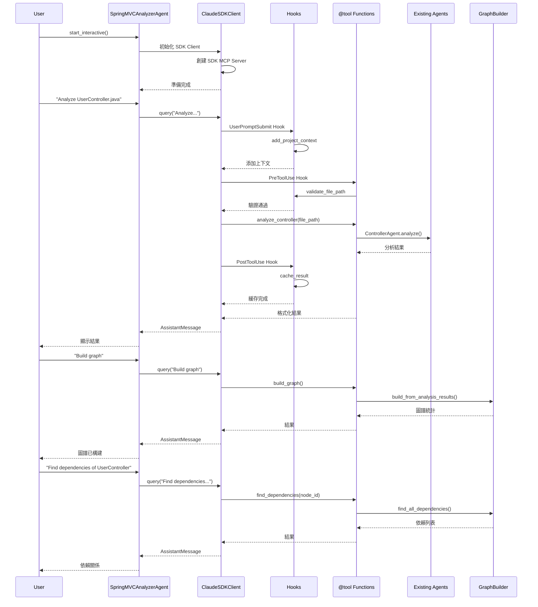

# SDK Agent Mode - 技術規格說明書

> **版本**: 1.0.0
> **狀態**: Draft
> **最後更新**: 2025-10-05
> **作者**: Claude Code Integration Team

---

## 📋 目錄

1. [概述](#概述)
2. [架構設計](#架構設計)
3. [模式對比](#模式對比)
4. [API 規格](#api-規格)
5. [工具規格](#工具規格)
6. [Hook 規格](#hook-規格)
7. [權限規格](#權限規格)
8. [數據流程](#數據流程)
9. [配置規格](#配置規格)
10. [錯誤處理](#錯誤處理)

---

## 概述

### 目標

在現有的 SpringMVC Agent Analyzer 基礎上，整合 **Claude Agent SDK**，實現第三種操作模式：**SDK Agent Mode**。

### 設計原則

1. **向後兼容** - 保留現有 API Mode 和 Passive Mode
2. **代碼復用** - 共享現有 agents, graph builder, prompt manager
3. **漸進式採用** - 可選功能，不強制遷移
4. **功能增強** - 利用 SDK 的高級特性（Hooks, Permission, 雙向對話）

### 核心價值

- ✅ **雙向交互** - 持續對話，而非一次性查詢
- ✅ **動態控制** - 運行時切換模型和權限
- ✅ **智能 Hook** - 自動驗證、緩存、上下文增強
- ✅ **細粒度權限** - 程序化控制工具使用
- ✅ **更好的 UX** - 流式響應，進度反饋

---

## 架構設計

### 三模式架構

```mermaid
graph TB
    subgraph "用戶入口"
        U[用戶]
    end

    subgraph "操作模式選擇"
        U --> M{選擇模式}
    end

    M --> API[API Mode<br/>MCP Server + API 訂閱]
    M --> Passive[Passive Mode<br/>MCP Server + Claude Code 訂閱]
    M --> SDK[SDK Agent Mode ⭐<br/>ClaudeSDKClient + SDK]

    subgraph "API Mode 實現"
        API --> MCP1[MCP Server]
        MCP1 --> MR[ModelRouter<br/>Haiku→Sonnet→Opus]
        MR --> Agents1[Agents]
    end

    subgraph "Passive Mode 實現"
        Passive --> MCP2[MCP Server]
        MCP2 --> Tools[MCP Tools<br/>read_file_with_prompt<br/>submit_analysis<br/>build_graph]
    end

    subgraph "SDK Agent Mode 實現 ⭐"
        SDK --> Client[ClaudeSDKClient]
        Client --> SDKServer[SDK MCP Server]
        SDKServer --> SDKTools[@tool 裝飾器<br/>analyze_controller<br/>analyze_directory<br/>query_graph]
        Client --> Hooks[Hooks System<br/>PreToolUse<br/>PostToolUse<br/>UserPromptSubmit]
        Client --> Perm[Permission System]
    end

    subgraph "共享組件層"
        Agents1 --> Shared
        Tools --> Shared
        SDKTools --> Shared
        Shared[ControllerAgent<br/>JSPAgent<br/>ServiceAgent<br/>MapperAgent<br/>ProcedureAgent<br/>GraphBuilder<br/>PromptManager]
    end

    style SDK fill:#90EE90
    style Client fill:#FFD700
    style Shared fill:#E0E0E0
```

### 目錄結構

```
springmvc-agent-analyzer/
├── agents/                      # 現有：共享 agents
├── graph/                       # 現有：共享 graph builder
├── core/                        # 現有：共享核心組件
├── mcp/                         # 現有：MCP Server（API + Passive）
│   └── server.py
├── sdk_agent/                   # 新增：SDK Agent 模式 ⭐
│   ├── __init__.py             # 導出主類和工具
│   ├── client.py               # SpringMVCAnalyzerAgent 主類
│   ├── tools/                  # SDK 工具實現
│   │   ├── __init__.py
│   │   ├── analysis_tools.py   # 分析相關工具
│   │   ├── graph_tools.py      # 圖譜相關工具
│   │   └── query_tools.py      # 查詢相關工具
│   ├── hooks/                  # Hook 實現
│   │   ├── __init__.py
│   │   ├── validation_hooks.py # 驗證 hooks
│   │   ├── context_hooks.py    # 上下文 hooks
│   │   └── cache_hooks.py      # 緩存 hooks
│   ├── permissions.py          # 權限控制邏輯
│   └── config.py               # SDK 配置管理
├── run_mcp_server.py           # 現有：MCP Server 入口
├── run_sdk_agent.py            # 新增：SDK Agent 入口 ⭐
├── config/
│   ├── config.yaml             # 現有：通用配置
│   └── sdk_agent_config.yaml  # 新增：SDK Agent 配置 ⭐
└── tests/
    └── integration/
        └── test_sdk_agent.py   # 新增：SDK Agent 測試 ⭐
```

---

## 模式對比

### 功能對比表

| 功能特性 | API Mode | Passive Mode | SDK Agent Mode ⭐ |
|---------|----------|--------------|-------------------|
| **API 訂閱需求** | ✅ 需要 | ❌ 不需要 | ✅ 需要 |
| **Claude Code 訂閱** | ❌ 不需要 | ✅ 需要 | ❌ 不需要 |
| **自主 LLM 分析** | ✅ 是 | ❌ 否（Claude Code 分析） | ✅ 是 |
| **模型路由** | ✅ Haiku→Sonnet→Opus | ❌ 單一模型 | ✅ 可配置 |
| **雙向交互** | ❌ 否 | ✅ 是 | ✅ 是 |
| **動態控制** | ❌ 否 | ❌ 否 | ✅ 是 |
| **Hooks 系統** | ❌ 無 | ❌ 無 | ✅ 完整支持 |
| **權限管理** | ❌ 基本 | ❌ 基本 | ✅ 細粒度 |
| **會話管理** | ❌ 無 | ❌ 無 | ✅ 分支、恢復 |
| **流式響應** | ✅ 是 | ✅ 是 | ✅ 是 + 部分消息 |
| **進度反饋** | ✅ 日誌 | ✅ 日誌 | ✅ 日誌 + Hook |
| **批量分析** | ✅ 自動 | ❌ 交互式 | ✅ 自動 + 可控 |
| **圖譜功能** | ✅ 完整 | ✅ 完整 | ✅ 完整 |
| **部署複雜度** | 中 | 低 | 中 |
| **適用場景** | 大規模批量 | 訂閱用戶 | 高級交互 |

### 使用場景建議

**API Mode**：
- 大規模批量分析
- CI/CD 集成
- 成本敏感（需要模型路由優化）
- 無需交互

**Passive Mode**：
- 只有 Claude Code 訂閱
- 交互式探索
- 學習和實驗
- 無需 API key

**SDK Agent Mode** ⭐：
- 需要雙向對話
- 需要動態控制（切換模型、權限）
- 需要高級 Hook（驗證、緩存、上下文）
- 需要會話管理
- 開發和調試

---

## API 規格

### SpringMVCAnalyzerAgent 類

```python
class SpringMVCAnalyzerAgent:
    """
    Spring MVC Analyzer Agent using Claude Agent SDK.

    提供雙向交互對話、動態控制、Hook 系統等高級功能。
    """

    def __init__(
        self,
        config_path: Optional[str] = None,
        system_prompt: Optional[str] = None,
        hooks_enabled: bool = True,
        permission_mode: str = "acceptEdits",
        max_turns: int = 20
    ):
        """
        初始化 SDK Agent。

        Args:
            config_path: 配置文件路徑，默認 config/sdk_agent_config.yaml
            system_prompt: 自定義 system prompt，默認使用預設
            hooks_enabled: 是否啟用 hooks，默認 True
            permission_mode: 權限模式，默認 acceptEdits
            max_turns: 最大對話輪數，默認 20
        """

    async def start_interactive(self) -> None:
        """
        啟動交互式對話模式。

        進入命令行交互界面，支持持續對話。
        輸入 exit/quit 退出。
        """

    async def analyze_project(
        self,
        project_path: str,
        output_format: str = "markdown"
    ) -> Dict[str, Any]:
        """
        一次性分析整個專案（非交互）。

        Args:
            project_path: 專案根目錄路徑
            output_format: 輸出格式 (markdown, json, html)

        Returns:
            分析結果字典
        """

    async def analyze_file(
        self,
        file_path: str,
        agent_type: Optional[str] = None
    ) -> Dict[str, Any]:
        """
        分析單個文件。

        Args:
            file_path: 文件路徑
            agent_type: Agent 類型，不指定則自動檢測

        Returns:
            分析結果
        """

    async def query(self, prompt: str) -> List[Message]:
        """
        發送查詢並獲取完整響應。

        Args:
            prompt: 查詢內容

        Returns:
            消息列表
        """

    async def query_stream(self, prompt: str) -> AsyncGenerator[Message, None]:
        """
        發送查詢並流式獲取響應。

        Args:
            prompt: 查詢內容

        Yields:
            消息流
        """

    async def set_model(self, model: str) -> None:
        """
        動態切換模型。

        Args:
            model: 模型名稱 (haiku, sonnet-4, opus-4)
        """

    async def set_permission_mode(self, mode: str) -> None:
        """
        動態切換權限模式。

        Args:
            mode: 權限模式 (default, acceptEdits, bypassPermissions, plan)
        """

    async def interrupt(self) -> None:
        """中斷當前執行。"""

    async def get_server_info(self) -> Dict[str, Any]:
        """獲取服務器信息。"""

    def get_graph(self) -> GraphBuilder:
        """獲取當前的知識圖譜實例。"""

    def export_graph(
        self,
        output_path: str,
        format: str = "json"
    ) -> None:
        """
        導出知識圖譜。

        Args:
            output_path: 輸出文件路徑
            format: 導出格式 (json, graphml, d3, cytoscape)
        """
```

---

## 工具規格

### 工具清單

| 工具名稱 | 功能 | 輸入 Schema | 復用組件 |
|---------|------|-------------|----------|
| `analyze_controller` | 分析 Controller 文件 | `{file_path: str}` | ControllerAgent |
| `analyze_jsp` | 分析 JSP 文件 | `{file_path: str}` | JSPAgent |
| `analyze_service` | 分析 Service 文件 | `{file_path: str}` | ServiceAgent |
| `analyze_mapper` | 分析 Mapper XML | `{file_path: str}` | MapperAgent |
| `analyze_procedure` | 分析存儲過程 | `{file_path: str}` | ProcedureAgent |
| `analyze_directory` | 批量分析目錄 | `{directory_path: str, pattern: str}` | All Agents |
| `build_graph` | 構建知識圖譜 | `{}` | GraphBuilder |
| `query_graph` | 查詢圖譜 | `{query_type: str, ...}` | GraphBuilder |
| `find_dependencies` | 查找依賴 | `{node_id: str}` | GraphBuilder |
| `analyze_impact` | 影響分析 | `{node_id: str}` | GraphBuilder |
| `export_graph` | 導出圖譜 | `{output_path: str, format: str}` | GraphBuilder |

### 工具實現範例

```python
from claude_agent_sdk import tool
from typing import Any, Dict
from agents.controller_agent import ControllerAgent
from core.prompt_manager import PromptManager

# 全局實例（單例）
_agents = {}

def get_agent(agent_type: str):
    """獲取或創建 agent 實例"""
    if agent_type not in _agents:
        if agent_type == "controller":
            _agents[agent_type] = ControllerAgent(...)
        # ... 其他 agent
    return _agents[agent_type]

@tool(
    name="analyze_controller",
    description="Analyze Spring MVC Controller file to extract mappings, dependencies, and methods",
    input_schema={
        "file_path": str,
        "include_details": bool
    }
)
async def analyze_controller(args: Dict[str, Any]) -> Dict[str, Any]:
    """
    分析 Controller 文件。

    復用現有的 ControllerAgent 實現。
    """
    file_path = args["file_path"]
    include_details = args.get("include_details", True)

    # 復用現有 agent
    agent = get_agent("controller")
    result = await agent.analyze(file_path)

    # 格式化輸出
    analysis = result.get("analysis", {})
    summary = f"""
Controller Analysis: {analysis.get('class_name', 'Unknown')}
=====================================
Package: {analysis.get('package', 'N/A')}
Base URL: {analysis.get('base_url', 'N/A')}
Methods: {len(analysis.get('methods', []))}
Dependencies: {len(analysis.get('dependencies', []))}
Confidence: {result.get('confidence', 0.0):.2f}
    """.strip()

    return {
        "content": [{
            "type": "text",
            "text": summary
        }],
        "analysis_data": result  # 額外數據供後續使用
    }

@tool(
    name="analyze_directory",
    description="Analyze all files in a directory matching a pattern",
    input_schema={
        "directory_path": str,
        "pattern": str,
        "recursive": bool
    }
)
async def analyze_directory(args: Dict[str, Any]) -> Dict[str, Any]:
    """批量分析目錄中的文件"""
    from pathlib import Path

    directory = Path(args["directory_path"])
    pattern = args.get("pattern", "**/*.java")
    recursive = args.get("recursive", True)

    if not directory.exists():
        return {
            "content": [{"type": "text", "text": f"Directory not found: {directory}"}],
            "is_error": True
        }

    # 查找文件
    if recursive:
        files = list(directory.glob(pattern))
    else:
        files = list(directory.glob(pattern.replace("**/", "")))

    # 批量分析
    results = []
    for file_path in files:
        # 自動檢測 agent 類型
        agent_type = _detect_agent_type(str(file_path))
        if agent_type:
            agent = get_agent(agent_type)
            result = await agent.analyze(str(file_path))
            results.append({
                "file": str(file_path),
                "type": agent_type,
                "result": result
            })

    summary = f"""
Directory Analysis Complete
=====================================
Total Files: {len(files)}
Analyzed: {len(results)}
    """.strip()

    return {
        "content": [{"type": "text", "text": summary}],
        "results": results
    }

def _detect_agent_type(file_path: str) -> Optional[str]:
    """自動檢測文件類型對應的 agent"""
    file_path_lower = file_path.lower()

    if file_path_lower.endswith(".jsp"):
        return "jsp"
    elif "controller" in file_path_lower and file_path_lower.endswith(".java"):
        return "controller"
    elif "service" in file_path_lower and file_path_lower.endswith(".java"):
        return "service"
    elif file_path_lower.endswith(".xml") and "mapper" in file_path_lower:
        return "mapper"
    elif file_path_lower.endswith((".sql", ".prc")):
        return "procedure"

    return None
```

---

## Hook 規格

### Hook 類型

| Hook Event | 觸發時機 | 用途 | 實現位置 |
|-----------|---------|------|---------|
| `PreToolUse` | 工具調用前 | 驗證輸入、檢查權限 | `validation_hooks.py` |
| `PostToolUse` | 工具調用後 | 緩存結果、記錄日誌 | `cache_hooks.py` |
| `UserPromptSubmit` | 用戶提交 prompt 後 | 添加上下文、增強 prompt | `context_hooks.py` |
| `Stop` | 會話停止時 | 清理資源、保存狀態 | `validation_hooks.py` |
| `PreCompact` | Context 壓縮前 | 記錄、分析 | `context_hooks.py` |

### Hook 實現範例

```python
# sdk_agent/hooks/validation_hooks.py
from typing import Any, Dict, Optional
from claude_agent_sdk.types import HookContext, HookJSONOutput

async def validate_file_path(
    input_data: Dict[str, Any],
    tool_use_id: Optional[str],
    context: HookContext
) -> HookJSONOutput:
    """
    PreToolUse Hook: 驗證文件路徑安全性。

    檢查：
    1. 路徑遍歷攻擊（../, ..\）
    2. 敏感目錄訪問（/etc/, C:\Windows）
    3. 文件存在性
    """
    tool_name = input_data.get("tool_name", "")
    tool_input = input_data.get("tool_input", {})

    # 只檢查文件分析工具
    if not tool_name.startswith("analyze_"):
        return {}

    file_path = tool_input.get("file_path", "")

    # 檢查路徑遍歷
    dangerous_patterns = ["../", "..\\", "/etc/", "C:\\Windows", "/root"]
    for pattern in dangerous_patterns:
        if pattern in file_path:
            return {
                "hookSpecificOutput": {
                    "hookEventName": "PreToolUse",
                    "permissionDecision": "deny",
                    "permissionDecisionReason": (
                        f"Dangerous path pattern detected: {pattern}\n"
                        f"Path: {file_path}"
                    )
                }
            }

    # 檢查文件存在性（可選）
    from pathlib import Path
    if not Path(file_path).exists():
        return {
            "hookSpecificOutput": {
                "hookEventName": "PreToolUse",
                "permissionDecision": "deny",
                "permissionDecisionReason": f"File not found: {file_path}"
            }
        }

    return {}

async def on_session_stop(
    input_data: Dict[str, Any],
    tool_use_id: Optional[str],
    context: HookContext
) -> HookJSONOutput:
    """
    Stop Hook: 會話停止時清理和保存。
    """
    # 保存當前圖譜狀態
    # 記錄會話統計
    # 清理臨時文件

    print("Session stopped - cleaning up...")
    return {}
```

```python
# sdk_agent/hooks/context_hooks.py
from typing import Any, Dict, Optional
from claude_agent_sdk.types import HookContext, HookJSONOutput

async def add_project_context(
    input_data: Dict[str, Any],
    tool_use_id: Optional[str],
    context: HookContext
) -> HookJSONOutput:
    """
    UserPromptSubmit Hook: 自動添加專案上下文信息。
    """
    additional_context = """

    ---
    [Project Context]
    Framework: Spring MVC 4.x
    Java Version: Java 8
    Build Tool: Maven
    ORM: MyBatis 3.x
    Frontend: JSP + jQuery

    Current Analysis Status:
    - Graph nodes: {node_count}
    - Graph edges: {edge_count}
    - Files analyzed: {file_count}
    """.format(
        node_count=get_graph_stats().get("num_nodes", 0),
        edge_count=get_graph_stats().get("num_edges", 0),
        file_count=len(get_analyzed_files())
    )

    return {
        "hookSpecificOutput": {
            "hookEventName": "UserPromptSubmit",
            "additionalContext": additional_context.strip()
        }
    }
```

---

## 權限規格

### Permission 回調

```python
# sdk_agent/permissions.py
from typing import Any, Dict
from claude_agent_sdk.types import (
    ToolPermissionContext,
    PermissionResult,
    PermissionResultAllow,
    PermissionResultDeny
)

async def can_use_tool(
    tool_name: str,
    tool_input: Dict[str, Any],
    context: ToolPermissionContext
) -> PermissionResult:
    """
    程序化控制工具使用權限。

    規則：
    1. 分析工具 - 檢查路徑
    2. 圖譜工具 - 總是允許
    3. 導出工具 - 檢查輸出路徑
    """

    # 分析工具權限
    if tool_name.startswith("mcp__analyzer__analyze_"):
        file_path = tool_input.get("file_path", "")

        # 只允許分析專案目錄內的文件
        allowed_dirs = ["/workspace", "C:\\workspace"]
        if not any(file_path.startswith(dir) for dir in allowed_dirs):
            return PermissionResultDeny(
                message=f"Only files in workspace can be analyzed: {file_path}",
                interrupt=False
            )

    # 導出工具權限
    if tool_name == "mcp__analyzer__export_graph":
        output_path = tool_input.get("output_path", "")

        # 檢查輸出路徑安全性
        if "../" in output_path or "..\\" in output_path:
            return PermissionResultDeny(
                message="Path traversal not allowed in output path",
                interrupt=True
            )

    # 默認允許
    return PermissionResultAllow()
```

---

## 數據流程

### 交互式分析流程



---

## 配置規格

### sdk_agent_config.yaml

```yaml
# SDK Agent 配置文件

# 服務器模式
server:
  mode: "agent"  # api | passive | agent

# SDK Agent 配置
agent:
  # SDK 功能開關
  sdk_enabled: true

  # System Prompt
  system_prompt_type: "default"  # default | custom
  custom_prompt_path: null       # 自定義 prompt 文件路徑

  # Hooks
  hooks_enabled: true
  enabled_hooks:
    - "PreToolUse"
    - "PostToolUse"
    - "UserPromptSubmit"
    - "Stop"

  # 權限
  permission_mode: "acceptEdits"  # default | acceptEdits | bypassPermissions | plan
  permission_callback_enabled: true

  # 會話
  max_turns: 20
  continue_conversation: false
  fork_session: false

  # 模型
  default_model: null  # 使用 CLI 默認模型

  # 工作目錄
  cwd: "."

  # 流式
  include_partial_messages: true

  # 工具
  allowed_tools:
    - "Read"
    - "Glob"
    - "Grep"
    - "mcp__analyzer__*"  # 允許所有 analyzer 工具

# 復用現有配置
llm:
  # ... 現有 llm 配置 ...

agents:
  # ... 現有 agents 配置 ...

graph:
  # ... 現有 graph 配置 ...
```

---

## 錯誤處理

### 錯誤類型

```python
# sdk_agent/exceptions.py

class SDKAgentError(Exception):
    """SDK Agent 基礎錯誤"""
    pass

class SDKNotInstalledError(SDKAgentError):
    """Claude Agent SDK 未安裝"""
    pass

class CLINotFoundError(SDKAgentError):
    """Claude Code CLI 未找到"""
    pass

class HookExecutionError(SDKAgentError):
    """Hook 執行錯誤"""
    pass

class PermissionDeniedError(SDKAgentError):
    """權限被拒絕"""
    pass

class ToolExecutionError(SDKAgentError):
    """工具執行錯誤"""
    pass
```

### 錯誤處理策略

```python
# sdk_agent/client.py

class SpringMVCAnalyzerAgent:
    async def query(self, prompt: str) -> List[Message]:
        """發送查詢，帶錯誤處理"""
        try:
            await self.client.query(prompt)

            messages = []
            async for msg in self.client.receive_response():
                messages.append(msg)

            return messages

        except CLINotFoundError:
            raise SDKAgentError(
                "Claude Code CLI not found. Please install: "
                "npm install -g @anthropic-ai/claude-code"
            )

        except Exception as e:
            # 記錄錯誤
            self.logger.error(f"Query failed: {e}", exc_info=True)
            raise SDKAgentError(f"Query execution failed: {str(e)}")
```

---

## 總結

### 核心特性

✅ **三模式架構** - API、Passive、SDK Agent
✅ **代碼復用** - 共享現有 agents 和 graph builder
✅ **@tool 裝飾器** - 簡化工具定義
✅ **完整 Hook 系統** - 驗證、緩存、上下文
✅ **細粒度權限** - 程序化控制
✅ **雙向交互** - 持續對話
✅ **動態控制** - 運行時切換

### 技術棧

- **Claude Agent SDK** >= 0.1.0
- **現有組件** - Agents, GraphBuilder, PromptManager
- **Python** 3.10+
- **AsyncIO** - 異步編程

### 下一步

參考 [SDK_AGENT_IMPLEMENTATION_PLAN.md](./SDK_AGENT_IMPLEMENTATION_PLAN.md) 了解詳細實施計劃。

---

**版本**: 1.0.0
**狀態**: Draft
**維護者**: SpringMVC Agent Analyzer Team
