# Technical Specification - SpringMVC Agent Analyzer

**Version**: 0.1.0
**Date**: 2025-10-05
**Status**: Design Phase
**Architecture**: LLM-First Agent-Based System

---

## Table of Contents

1. [System Overview](#system-overview)
2. [Architecture Diagrams](#architecture-diagrams)
3. [Component Specifications](#component-specifications)
4. [Data Models](#data-models)
5. [API Interfaces](#api-interfaces)
6. [Sequence Flows](#sequence-flows)
7. [Configuration Reference](#configuration-reference)
8. [Performance Requirements](#performance-requirements)
9. [Security Considerations](#security-considerations)
10. [Deployment Architecture](#deployment-architecture)

---

## System Overview

### Purpose

Automated knowledge graph construction for legacy SpringMVC + JSP + MyBatis + Oracle applications using LLM-driven agent analysis.

### Key Differentiators

| Aspect | Traditional Approach | This System |
|--------|---------------------|-------------|
| **Primary Analysis** | AST Parsers (javalang, lxml) | LLM Agents (Claude) |
| **Context Handling** | Fixed ±15 lines | Adaptive (LLM decides) |
| **Model Strategy** | Single model | Hierarchical (Haiku→Sonnet→Opus) |
| **Cost per 100 files** | ~$40 | ~$4.23 (53% reduction) |
| **Maintenance** | ~$12K/year (parser updates) | ~$2K/year (prompt refinements) |
| **Accuracy** | 85-90% (breaks on edge cases) | 90-95% (handles edge cases) |

### Technology Stack

```
Language: Python 3.10+
LLM Provider: Anthropic Claude (Haiku, Sonnet, Opus)
Graph Library: NetworkX 3.4+
Protocol: MCP (Model Context Protocol)
Storage: JSON, JSONL, Pickle (cache)
Validation: javalang (Java), lxml (XML), sqlparse (SQL)
Testing: pytest, pytest-asyncio
```

---

## Architecture Diagrams

### 1. High-Level System Architecture

```mermaid
graph TB
    subgraph "Client Layer"
        CC[Claude Code CLI]
        MC[Other MCP Clients]
    end

    subgraph "MCP Server Layer"
        MS[MCP Server]
        TH[Tool Handlers]
    end

    subgraph "Core Infrastructure"
        MR[Model Router<br/>Haiku→Sonnet→Opus]
        PM[Prompt Manager<br/>Templates + Learning]
        CT[Cost Tracker<br/>Budget Monitor]
        SC[Semantic Cache<br/>60-80% Hit Rate]
    end

    subgraph "Agent Layer"
        CA[Controller Agent]
        JA[JSP Agent]
        SA[Service Agent]
        MA[Mapper Agent]
        PA[Procedure Agent]
    end

    subgraph "Validation Layer"
        JV[Java Validator]
        XV[XML Validator]
        SV[SQL Validator]
    end

    subgraph "Graph Layer"
        GB[Graph Builder<br/>NetworkX]
        QE[Query Engine<br/>Chains/Impact]
        VZ[Visualizer<br/>Mermaid/PyVis]
    end

    subgraph "External Services"
        API[Anthropic API]
        DB[(Oracle DB)]
    end

    CC -->|MCP Protocol| MS
    MC -->|MCP Protocol| MS
    MS --> TH

    TH --> MR
    TH --> PM
    TH --> CT
    TH --> SC

    MR --> CA
    MR --> JA
    MR --> SA
    MR --> MA
    MR --> PA

    CA --> JV
    SA --> JV
    JA --> XV
    MA --> XV
    MA --> SV

    CA --> GB
    JA --> GB
    SA --> GB
    MA --> GB
    PA --> GB

    GB --> QE
    QE --> VZ

    MR -.->|API Calls| API
    PA -.->|Schema Query| DB

    style MR fill:#ff9999
    style PM fill:#99ccff
    style SC fill:#99ff99
    style CT fill:#ffcc99
```



### 2. Agent Analysis Flow


### 3. Model Router Decision Tree


### 4. Knowledge Graph Schema


### 5. Component Dependency Diagram


### 6. Data Flow - End-to-End Analysis


### 7. Prompt Learning Loop


---

## Component Specifications

### 1. BaseAgent (agents/base_agent.py)

**Purpose**: Abstract base class for all analysis agents.

**Class Definition**:

```python
from abc import ABC, abstractmethod
from typing import Dict, Any, Optional
from core.model_router import ModelRouter
from core.prompt_manager import PromptManager
from core.cost_tracker import CostTracker
from core.cache_manager import CacheManager

class BaseAgent(ABC):
    """
    Base class for all LLM-driven analysis agents.

    Responsibilities:
    1. File loading with context management
    2. Prompt construction via PromptManager
    3. LLM querying via ModelRouter
    4. Response parsing (JSON extraction)
    5. Result validation
    6. Cost tracking
    7. Cache management
    """

    def __init__(
        self,
        agent_name: str,
        model_router: ModelRouter,
        prompt_manager: PromptManager,
        cost_tracker: CostTracker,
        cache_manager: CacheManager,
        config: Dict[str, Any]
    ):
        self.agent_name = agent_name
        self.model_router = model_router
        self.prompt_manager = prompt_manager
        self.cost_tracker = cost_tracker
        self.cache_manager = cache_manager
        self.config = config
        self.logger = logging.getLogger(f"agents.{agent_name}")

    @abstractmethod
    async def analyze(self, file_path: str, **kwargs) -> Dict[str, Any]:
        """
        Main analysis method - implemented by subclasses.

        Args:
            file_path: Path to file to analyze
            **kwargs: Agent-specific parameters

        Returns:
            {
                "file_path": str,
                "analysis": Dict,  # Agent-specific structure
                "confidence": float,
                "model_used": str,
                "cost": float,
                "timestamp": str,
                "cached": bool
            }
        """
        pass

    async def _query_llm(
        self,
        prompt: str,
        complexity: str = "medium",
        max_tokens: int = 4096
    ) -> Dict[str, Any]:
        """
        Query LLM via ModelRouter with automatic cost tracking.

        Args:
            prompt: Prompt to send
            complexity: "simple" | "medium" | "complex"
            max_tokens: Maximum response tokens

        Returns:
            {
                "response": str,
                "model": str,
                "cost": float,
                "tokens": {"input": int, "output": int},
                "confidence": float,
                "escalations": int
            }
        """
        pass

    def _load_file_with_context(
        self,
        file_path: str,
        target_line: Optional[int] = None,
        context_lines: int = 20
    ) -> str:
        """
        Load file with optional context window.

        If target_line is None, load entire file.
        Otherwise, load ±context_lines around target_line.
        """
        pass

    def _extract_json_from_response(self, response: str) -> Dict[str, Any]:
        """
        Extract JSON from LLM response.

        Handles:
        - Raw JSON: {"key": "value"}
        - Markdown: ```json\n{...}\n```
        - Mixed: "Here's the result:\n```json..."
        """
        pass

    async def validate_result(self, result: Dict[str, Any]) -> bool:
        """
        Validate analysis result.

        Default: Check confidence >= threshold.
        Override in subclasses for domain-specific validation.
        """
        pass
```

**Configuration Schema**:

```yaml
agents:
  base:
    min_confidence: 0.7
    max_file_size: 1000000  # 1MB
    default_context_lines: 20
    enable_caching: true
    retry_on_error: 3
    timeout: 60
```

**Metrics Tracked**:
- Queries per agent
- Average confidence
- Cache hit rate
- Total cost
- Average latency

---

### 2. ModelRouter (core/model_router.py)

**Purpose**: Hierarchical model selection for cost optimization.

**Class Definition**:

```python
from typing import Dict, Any, Optional
from anthropic import Anthropic
import anthropic

class ModelRouter:
    """
    Routes queries to appropriate Claude model based on complexity and confidence.

    Strategy:
    1. Simple tasks → Try Haiku ($0.25/1M tokens)
    2. If Haiku confidence < 0.9 → Escalate to Sonnet ($3/1M)
    3. If Sonnet confidence < 0.85 → Escalate to Opus ($15/1M)

    Expected Savings: 50-70% cost reduction vs Sonnet-only
    """

    MODELS = {
        "haiku": {
            "name": "claude-3-5-haiku-20241022",
            "cost_per_mtok_input": 0.25,
            "cost_per_mtok_output": 1.25,
            "max_tokens": 8192,
            "best_for": ["simple controllers", "basic services", "standard CRUD"]
        },
        "sonnet": {
            "name": "claude-3-5-sonnet-20250929",
            "cost_per_mtok_input": 3.0,
            "cost_per_mtok_output": 15.0,
            "max_tokens": 8192,
            "best_for": ["complex JSP", "nested mappers", "SQL analysis"]
        },
        "opus": {
            "name": "claude-3-opus-20240229",
            "cost_per_mtok_input": 15.0,
            "cost_per_mtok_output": 75.0,
            "max_tokens": 4096,
            "best_for": ["ambiguous deps", "complex procedures", "edge cases"]
        }
    }

    THRESHOLDS = {
        "haiku_confidence": 0.9,
        "sonnet_confidence": 0.85
    }

    async def query(
        self,
        prompt: str,
        complexity: str = "medium",
        max_tokens: int = 4096,
        force_model: Optional[str] = None
    ) -> Dict[str, Any]:
        """
        Execute hierarchical query with automatic escalation.

        Returns:
            {
                "response": str,
                "model": str,
                "cost": float,
                "tokens": {"input": int, "output": int},
                "confidence": float,
                "escalations": int
            }
        """
        pass

    async def _query_model(
        self,
        model_tier: str,
        prompt: str,
        max_tokens: int
    ) -> Dict[str, Any]:
        """Execute actual Anthropic API call."""
        pass

    def _extract_confidence(self, response: str) -> float:
        """
        Extract confidence score from LLM response.

        Expected format: JSON with "confidence" field.
        Fallback: 0.5 if not found.
        """
        pass

    def _calculate_cost(
        self,
        model_tier: str,
        input_tokens: int,
        output_tokens: int
    ) -> float:
        """Calculate cost based on token usage."""
        pass
```

**API Response Format**:

```json
{
    "response": "{\n  \"class_name\": \"UserController\",\n  ...\n}",
    "model": "claude-3-5-haiku-20241022",
    "cost": 0.00234,
    "tokens": {
        "input": 1245,
        "output": 356
    },
    "confidence": 0.92,
    "escalations": 0
}
```

**Decision Logic**:

```python
# Pseudocode
if complexity in ["simple", "medium"]:
    result = query_haiku(prompt)
    if result.confidence >= 0.9:
        return result  # 70% of cases end here
    else:
        escalate_to_sonnet()

result = query_sonnet(prompt)
if result.confidence >= 0.85:
    return result  # 25% of cases end here
else:
    escalate_to_opus()

return query_opus(prompt)  # 5% of cases
```

---

### 3. PromptManager (core/prompt_manager.py)

**Purpose**: Centralized prompt template and few-shot example management.

**Class Definition**:

```python
from typing import Dict, Any, List, Optional
from pathlib import Path
import json

class PromptManager:
    """
    Manages prompt templates and few-shot examples.

    Features:
    1. Load templates from prompts/base/*.txt
    2. Load few-shot examples from prompts/examples/*.json
    3. Inject examples into prompts
    4. Learn from successful/failed results
    5. Version prompts for A/B testing
    """

    def __init__(self, prompts_dir: str = "prompts"):
        self.prompts_dir = Path(prompts_dir)
        self.base_prompts: Dict[str, str] = {}
        self.examples: Dict[str, List[Dict]] = {}
        self.learned_patterns: List[Dict] = []

        self._load_base_prompts()
        self._load_examples()
        self._load_learned_patterns()

    def build_prompt(
        self,
        template_name: str,
        context: Dict[str, Any],
        include_examples: bool = True,
        max_examples: int = 3
    ) -> str:
        """
        Build complete prompt from template + context + examples.

        Args:
            template_name: Name of template (e.g., "controller_analysis")
            context: Variables to inject (e.g., {"file_path": "...", "code": "..."})
            include_examples: Whether to add few-shot examples
            max_examples: Max number of examples

        Returns:
            Complete prompt ready for LLM
        """
        pass

    def learn_from_result(
        self,
        template_name: str,
        input_data: Dict[str, Any],
        output: Dict[str, Any],
        feedback: Dict[str, Any]
    ):
        """
        Learn from analysis result.

        If correct: Save as positive example
        If incorrect: Analyze failure and improve prompt

        Args:
            template_name: Which prompt was used
            input_data: Input context
            output: LLM output
            feedback: {"correct": bool, "issues": List[str]}
        """
        pass

    def _format_examples(self, examples: List[Dict]) -> str:
        """Format few-shot examples as text."""
        pass

    def _save_learned_pattern(self, template_name: str, pattern: Dict):
        """Save to prompts/learned/<template>_learned.jsonl"""
        pass
```

**Prompt Template Format** (`prompts/base/controller_analysis.txt`):

```
You are a Java Spring Framework expert analyzer.

Analyze the following Spring Controller file and extract its structure.

# Task

Extract:
1. Class name and package
2. Class-level @RequestMapping path
3. Method-level request mappings (combine with class-level)
4. HTTP methods (GET/POST/PUT/DELETE)
5. Service dependencies (@Autowired)

# Input

File: {file_path}

```java
{code}
```

# Output Format

Return ONLY valid JSON (no markdown, no explanation):

{{
  "class_name": "string",
  "package": "string",
  "class_level_mapping": "string or null",
  "mappings": [
    {{
      "method_name": "string",
      "path": "string",
      "http_method": "string",
      "parameters": [...]
    }}
  ],
  "dependencies": [...],
  "confidence": 0.0-1.0,
  "notes": "string"
}}

# Confidence Guidelines

- 0.9-1.0: Very clear, standard pattern
- 0.8-0.9: Clear with minor ambiguity
- 0.7-0.8: Some ambiguity, reasonable inference
- < 0.7: High ambiguity, low confidence
```

**Few-Shot Example Format** (`prompts/examples/controller_analysis.json`):

```json
[
  {
    "description": "Simple controller with class-level mapping",
    "input": "@Controller\n@RequestMapping(\"/users\")\npublic class UserController {\n    @Autowired\n    private UserService userService;\n\n    @GetMapping(\"/list\")\n    public ModelAndView listUsers() {\n        return new ModelAndView(\"users/list\");\n    }\n}",
    "output": {
      "class_name": "UserController",
      "package": "unknown",
      "class_level_mapping": "/users",
      "mappings": [
        {
          "method_name": "listUsers",
          "path": "/users/list",
          "http_method": "GET",
          "parameters": []
        }
      ],
      "dependencies": [
        {"field_name": "userService", "type": "UserService"}
      ],
      "confidence": 0.95,
      "notes": "Standard Spring MVC pattern"
    }
  },
  {
    "description": "REST controller without class-level mapping",
    "input": "@RestController\npublic class ApiController {\n    @PostMapping(\"/api/save\")\n    public ResponseEntity<User> saveUser(@RequestBody User user) {\n        return ResponseEntity.ok(user);\n    }\n}",
    "output": {
      "class_name": "ApiController",
      "package": "unknown",
      "class_level_mapping": null,
      "mappings": [
        {
          "method_name": "saveUser",
          "path": "/api/save",
          "http_method": "POST",
          "parameters": [
            {"name": "user", "type": "User", "annotation": "@RequestBody"}
          ]
        }
      ],
      "dependencies": [],
      "confidence": 0.9,
      "notes": "REST controller, no class-level mapping"
    }
  }
]
```

---

### 4. CacheManager (core/cache_manager.py)

**Purpose**: Semantic caching to reduce redundant LLM queries.

**Class Definition**:

```python
from typing import Dict, Any, Optional
import hashlib
import pickle
from pathlib import Path

class CacheManager:
    """
    Semantic cache for LLM analysis results.

    Strategy:
    - Level 1: Exact hash match (instant)
    - Level 2: Semantic similarity (future: vector embeddings)

    Expected Hit Rate: 60-80%
    """

    def __init__(
        self,
        cache_dir: str = ".cache",
        ttl_days: int = 30,
        max_cache_size: int = 10000
    ):
        self.cache_dir = Path(cache_dir)
        self.ttl_days = ttl_days
        self.max_cache_size = max_cache_size

        self.stats = {
            "hits": 0,
            "misses": 0,
            "saves": 0,
            "evictions": 0
        }

    def get(
        self,
        agent_name: str,
        file_path: str,
        file_content: str
    ) -> Optional[Dict[str, Any]]:
        """
        Retrieve cached result if available.

        Returns:
            Cached result or None if miss
        """
        pass

    def save(
        self,
        agent_name: str,
        file_path: str,
        file_content: str,
        result: Dict[str, Any]
    ):
        """Save result to cache."""
        pass

    def _compute_cache_key(
        self,
        agent_name: str,
        file_path: str,
        file_content: str
    ) -> str:
        """
        Compute cache key: hash(agent + file_path + content_hash)

        Future: Use semantic embeddings for similarity matching
        """
        pass

    def _is_expired(self, cache_file: Path) -> bool:
        """Check if cache entry is older than TTL."""
        pass

    def get_stats(self) -> Dict[str, Any]:
        """
        Get cache statistics.

        Returns:
            {
                "hits": int,
                "misses": int,
                "hit_rate": float,
                "cache_files": int,
                "cache_size_mb": float
            }
        """
        pass

    def clear(self, older_than_days: Optional[int] = None):
        """Clear cache (all or older than X days)."""
        pass
```

**Cache File Structure**:

```
.cache/
├── controller_a3f5b9c2.pkl  # Hash of (agent + file + content)
├── controller_d8e2c4a1.pkl
├── jsp_f1a3b5e7.pkl
├── service_c9d2e1f4.pkl
└── ...
```

**Cache Entry Format** (pickled):

```python
{
    "agent_name": "controller",
    "file_path": "src/controllers/UserController.java",
    "file_hash": "a3f5b9c2...",
    "timestamp": "2025-10-05T10:30:45",
    "result": {
        "class_name": "UserController",
        "mappings": [...],
        "confidence": 0.92,
        "model_used": "claude-3-5-haiku-20241022",
        "cost": 0.00234
    }
}
```

**Cache Invalidation Strategy**:

1. **TTL-based**: Delete entries older than 30 days
2. **Size-based**: Evict oldest if cache > max_size
3. **Manual**: Clear all or specific patterns

---

### 5. CostTracker (core/cost_tracker.py)

**Purpose**: Real-time cost monitoring and budget management.

**Class Definition**:

```python
from typing import Dict, Any, List
from pathlib import Path
from datetime import datetime
import json

class CostTracker:
    """
    Tracks LLM API costs in real-time.

    Features:
    - Per-agent breakdown
    - Per-model breakdown
    - Budget alerts (80% threshold)
    - Cost projections
    - JSONL logging for analysis
    """

    def __init__(
        self,
        output_file: str = "output/cost_tracker.jsonl",
        budget_per_project: float = 5.0,
        alert_threshold: float = 0.8
    ):
        self.output_file = Path(output_file)
        self.budget_per_project = budget_per_project
        self.alert_threshold = alert_threshold

        self.session_costs: List[Dict] = []
        self.total_cost = 0.0

    def record(
        self,
        agent: str,
        model: str,
        tokens: Dict[str, int],
        cost: float,
        cached: bool = False
    ):
        """
        Record a single query cost.

        Args:
            agent: Agent name (e.g., "controller")
            model: Model used (e.g., "claude-3-5-haiku-20241022")
            tokens: {"input": int, "output": int}
            cost: Cost in USD
            cached: Whether result was cached
        """
        pass

    def get_summary(self) -> Dict[str, Any]:
        """
        Get cost summary for current session.

        Returns:
            {
                "total_cost": float,
                "total_queries": int,
                "cached_queries": int,
                "cache_savings": float,
                "budget_remaining": float,
                "budget_usage_pct": float,
                "by_agent": {...},
                "by_model": {...}
            }
        """
        pass

    def print_summary(self):
        """Print formatted cost summary to console."""
        pass

    def project_cost(self, remaining_files: int, avg_cost_per_file: float) -> float:
        """
        Project total cost based on current average.

        Returns:
            Projected total cost
        """
        pass

    def check_budget(self) -> Dict[str, Any]:
        """
        Check budget status.

        Returns:
            {
                "within_budget": bool,
                "usage_pct": float,
                "remaining": float,
                "alert": bool
            }
        """
        pass
```

**JSONL Log Format**:

```jsonl
{"timestamp":"2025-10-05T10:30:45","agent":"controller","model":"claude-3-5-haiku-20241022","tokens":{"input":1245,"output":356},"cost":0.00234,"cached":false}
{"timestamp":"2025-10-05T10:31:12","agent":"controller","model":"claude-3-5-haiku-20241022","tokens":{"input":0,"output":0},"cost":0.0,"cached":true}
{"timestamp":"2025-10-05T10:32:03","agent":"jsp","model":"claude-3-5-sonnet-20250929","tokens":{"input":2341,"output":512},"cost":0.01523,"cached":false}
```

**Cost Summary Output**:

```
============================================================
💰 COST SUMMARY
============================================================
Total Cost: $2.34
Total Queries: 100
Cached Queries: 60 (60.0%)
Cache Savings: $1.40

Budget: $5.00
Remaining: $2.66 (53.2%)
Status: ✅ Within Budget

By Agent:
  controller: $0.45 (20 queries)
  jsp: $1.23 (40 queries)
  service: $0.34 (25 queries)
  mapper: $0.32 (15 queries)

By Model:
  haiku: $0.67 (70 queries, 98,234 tokens)
  sonnet: $1.54 (25 queries, 45,123 tokens)
  opus: $0.13 (5 queries, 3,456 tokens)
============================================================
```

---

## Data Models

### Agent Analysis Result

**Schema**:

```typescript
interface AnalysisResult {
  file_path: string;
  agent_name: string;
  timestamp: string;  // ISO 8601
  cached: boolean;

  analysis: {
    // Agent-specific structure (see below)
  };

  metadata: {
    confidence: number;  // 0.0 - 1.0
    model_used: string;
    cost: number;
    tokens: {
      input: number;
      output: number;
    };
    escalations: number;
    validation: {
      syntax_valid: boolean;
      issues: string[];
    };
  };
}
```

### Controller Analysis Result

```typescript
interface ControllerAnalysis {
  class_name: string;
  package: string;
  class_level_mapping: string | null;

  mappings: Array<{
    method_name: string;
    path: string;  // Combined class + method path
    http_method: "GET" | "POST" | "PUT" | "DELETE" | "PATCH";
    parameters: Array<{
      name: string;
      type: string;
      annotation: string;  // e.g., "@RequestParam", "@PathVariable"
    }>;
    return_type: string;
  }>;

  dependencies: Array<{
    field_name: string;
    type: string;
    annotation: string;  // e.g., "@Autowired"
  }>;

  confidence: number;
  notes: string;
}
```

### JSP Analysis Result

```typescript
interface JSPAnalysis {
  file_path: string;

  includes: Array<{
    type: "static" | "dynamic";  // <%@ include %> vs <jsp:include>
    target: string;
  }>;

  ajax_calls: Array<{
    type: "jquery" | "fetch" | "xhr";
    url: string;
    method: "GET" | "POST" | "PUT" | "DELETE";
    line_number: number;
    code_snippet: string;
  }>;

  forms: Array<{
    action: string;
    method: "GET" | "POST";
    id: string | null;
    line_number: number;
  }>;

  el_expressions: Array<{
    expression: string;
    context: string;
    line_number: number;
  }>;

  tag_libraries: Array<{
    prefix: string;
    uri: string;
  }>;

  confidence: number;
  notes: string;
}
```

### Knowledge Graph Node

```typescript
type NodeType =
  | "JSP"
  | "CONTROLLER"
  | "SERVICE"
  | "MAPPER"
  | "TABLE"
  | "PROCEDURE"
  | "ORACLE_JOB";

interface GraphNode {
  id: string;  // Unique identifier
  type: NodeType;

  // Common properties
  name: string;
  file_path?: string;

  // Type-specific properties
  properties: {
    // JSP
    includes?: string[];
    ajax_count?: number;

    // CONTROLLER
    class_name?: string;
    mappings?: Array<{path: string, method: string}>;

    // SERVICE
    transactional?: boolean;

    // MAPPER
    xml_file?: string;
    statement_count?: number;

    // TABLE
    columns?: string[];
    primary_key?: string[];

    // PROCEDURE
    operation_type?: string;
    trigger_method?: string;
  };
}
```

### Knowledge Graph Edge

```typescript
type EdgeType =
  | "INCLUDES"
  | "AJAX_CALL"
  | "INVOKES"
  | "CALLS"
  | "QUERIES"
  | "EXECUTES"
  | "SCHEDULED";

interface GraphEdge {
  source: string;  // Node ID
  target: string;  // Node ID
  relation: EdgeType;

  // Relation-specific attributes
  attributes: {
    // AJAX_CALL
    url?: string;
    http_method?: string;

    // QUERIES
    operation?: "SELECT" | "INSERT" | "UPDATE" | "DELETE" | "TRUNCATE";
    columns?: string[];

    // INVOKES / CALLS
    method?: string;

    // Confidence (for LLM-inferred edges)
    confidence?: number;
  };
}
```

---

## API Interfaces

### MCP Tool Definitions

#### 1. analyze_controller

**Description**: Analyze a Spring Controller file.

**Input Schema**:

```json
{
  "type": "object",
  "properties": {
    "file_path": {
      "type": "string",
      "description": "Absolute path to Controller Java file"
    },
    "force_refresh": {
      "type": "boolean",
      "description": "Bypass cache and re-analyze",
      "default": false
    }
  },
  "required": ["file_path"]
}
```

**Output Schema**:

```json
{
  "type": "object",
  "properties": {
    "file_path": {"type": "string"},
    "analysis": {
      "type": "object",
      "properties": {
        "class_name": {"type": "string"},
        "package": {"type": "string"},
        "mappings": {"type": "array"},
        "dependencies": {"type": "array"}
      }
    },
    "metadata": {
      "type": "object",
      "properties": {
        "confidence": {"type": "number"},
        "model_used": {"type": "string"},
        "cost": {"type": "number"},
        "cached": {"type": "boolean"}
      }
    }
  }
}
```

#### 2. build_graph

**Description**: Build knowledge graph from project directory.

**Input Schema**:

```json
{
  "type": "object",
  "properties": {
    "project_dir": {
      "type": "string",
      "description": "Root directory of SpringMVC project"
    },
    "file_patterns": {
      "type": "object",
      "description": "File patterns to include",
      "properties": {
        "controllers": {"type": "string", "default": "**/*Controller.java"},
        "jsps": {"type": "string", "default": "**/*.jsp"},
        "services": {"type": "string", "default": "**/*Service.java"},
        "mappers": {"type": "string", "default": "**/*Mapper.xml"}
      }
    },
    "max_workers": {
      "type": "integer",
      "description": "Parallel processing workers",
      "default": 4
    }
  },
  "required": ["project_dir"]
}
```

**Output Schema**:

```json
{
  "type": "object",
  "properties": {
    "graph_file": {"type": "string", "description": "Path to saved graph JSON"},
    "statistics": {
      "type": "object",
      "properties": {
        "total_nodes": {"type": "integer"},
        "total_edges": {"type": "integer"},
        "nodes_by_type": {"type": "object"},
        "edges_by_type": {"type": "object"},
        "orphaned_nodes": {"type": "array"}
      }
    },
    "cost_summary": {
      "type": "object",
      "properties": {
        "total_cost": {"type": "number"},
        "cached_rate": {"type": "number"},
        "files_analyzed": {"type": "integer"}
      }
    },
    "warnings": {"type": "array"}
  }
}
```

#### 3. query_chain

**Description**: Find call chain between two nodes.

**Input Schema**:

```json
{
  "type": "object",
  "properties": {
    "start_node": {
      "type": "string",
      "description": "Starting node ID or pattern"
    },
    "end_node": {
      "type": "string",
      "description": "Ending node ID or pattern"
    },
    "max_depth": {
      "type": "integer",
      "description": "Maximum path depth",
      "default": 10
    },
    "max_paths": {
      "type": "integer",
      "description": "Maximum paths to return",
      "default": 100
    }
  },
  "required": ["start_node", "end_node"]
}
```

**Output Schema**:

```json
{
  "type": "object",
  "properties": {
    "paths": {
      "type": "array",
      "items": {
        "type": "object",
        "properties": {
          "nodes": {"type": "array"},
          "edges": {"type": "array"},
          "length": {"type": "integer"},
          "confidence": {"type": "number"}
        }
      }
    },
    "total_paths": {"type": "integer"},
    "truncated": {"type": "boolean"}
  }
}
```

---

## Sequence Flows

### Complete Analysis Workflow


---

## Configuration Reference

### config/config.yaml

```yaml
# LLM Model Configuration
llm:
  routing:
    screening_model: "claude-3-5-haiku-20241022"
    screening_cost_per_mtok: 0.25

    analysis_model: "claude-3-5-sonnet-20250929"
    analysis_cost_per_mtok: 3.0

    critical_model: "claude-3-opus-20240229"
    critical_cost_per_mtok: 15.0

  thresholds:
    screening_confidence: 0.9
    analysis_confidence: 0.85

  api:
    max_tokens: 4096
    temperature: 0.1
    timeout: 60

# Cache Configuration
cache:
  enabled: true
  similarity_threshold: 0.85
  max_cache_size: 10000
  ttl_days: 30
  cache_dir: ".cache"

# Cost Configuration
cost:
  budget_per_project: 5.0
  alert_threshold: 0.8
  output_file: "output/cost_tracker.jsonl"

# Agent Configuration
agents:
  adaptive_context:
    enabled: true
    min_lines: 5
    max_lines: 50

  batch_size: 10
  max_workers: 4
  min_confidence: 0.7
  retry_on_error: 3

# Graph Configuration
graph:
  max_depth: 10
  max_paths: 100
  enable_edge_lookup_cache: true
  log_performance_metrics: true

# Output Configuration
output:
  base_dir: "output"
  format: "json"
  save_intermediate: true

  visualization:
    formats: ["mermaid", "pyvis", "graphml"]
    max_nodes_interactive: 1000
```

---

## Performance Requirements

### Latency Targets

| Operation | Target | Maximum |
|-----------|--------|---------|
| Single file analysis | < 2s | < 5s |
| Cache lookup | < 50ms | < 100ms |
| Graph build (100 files) | < 60s | < 120s |
| Graph query (chain) | < 500ms | < 2s |
| Visualization (500 nodes) | < 3s | < 10s |

### Throughput Targets

| Metric | Target |
|--------|--------|
| Files analyzed per minute | >= 30 |
| Cache hit rate | >= 60% |
| Parallel workers | 4 (configurable) |

### Resource Constraints

| Resource | Limit |
|----------|-------|
| Memory usage | < 2GB |
| Disk cache size | < 1GB |
| API rate limit | Respect Anthropic limits |

---

## Security Considerations

### API Key Management

```python
# NEVER hardcode API keys
# Use environment variables
import os
api_key = os.getenv("ANTHROPIC_API_KEY")

# Or use .env file (not committed to git)
from dotenv import load_dotenv
load_dotenv()
```

### Database Credentials

```yaml
# config/oracle_config.yaml (in .gitignore)
databases:
  dev:
    host: "localhost"
    user: "dev_user"
    # Password from env: ORACLE_DEV_PASSWORD
```

### Data Privacy

- **No sensitive data to LLM**: Only code structure, no credentials
- **Local processing**: Database extraction happens locally
- **Cache security**: Cache files contain only analysis results, no secrets

---

## Deployment Architecture

### Local Development


### Production Deployment (Future)


---

## Version History

| Version | Date | Changes |
|---------|------|---------|
| 0.1.0 | 2025-10-05 | Initial specification |

---

**Document Status**: Complete
**Next Review**: After Phase 2 POC
**Maintained By**: Development Team
